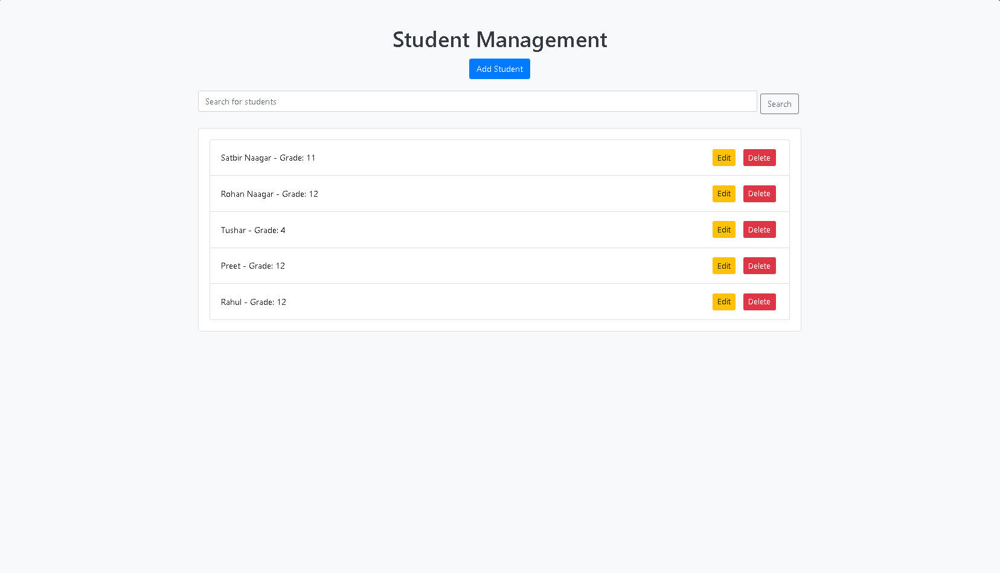

---

# 🎓 Student Management System 📚

Welcome to the **student management system**! This application is designed to help you manage student records easily and efficiently. Built with **Flask**, it provides a clean and intuitive interface for adding and viewing students.

---

## ✨ Features

- **👨‍🎓 Add Students**: Quickly add new students with their names and grades.
- **📜 View Student List**: Easily view all enrolled students in a user-friendly format.
- **📱 Responsive Design**: Seamlessly works on both desktop and mobile devices.
- **🗃️ In-memory Database**: For demonstration purposes, student data is stored in memory.

---

## 📸 Demo

  
*Experience how the app simplifies student management!*

---

## ⚙️ Technologies Used

- **Backend**: [Flask](https://flask.palletsprojects.com/en/2.2.x/) (Python)
- **Frontend**: HTML, CSS
- **Database**: In-memory (for demonstration)

---

## 🚀 Installation

To get started with the School Management App, follow these steps:

### 🔧 Prerequisites

Ensure you have Python installed on your system. You can download it from [python.org](https://www.python.org/downloads/).

### 📥 Clone the Repository

```bash
git clone https://github.com/chrohangurjar1/StudentManagementSystem.git
cd school_management_app
```

### 🐍 Install Flask

You can install Flask using pip:

```bash
pip install Flask
```

### 🏃 Run the Application

Once you have Flask installed, you can start the application:

```bash
python app.py
```

Open your web browser and navigate to `http://127.0.0.1:5000` to access the app.

---

## 🖥️ Usage

1. **🆕 Adding Students**: Click on the "Add Student" link to enter a new student's name and grade.
2. **👁️ Viewing Students**: After adding a student, you will be redirected to the main page, where you can see the list of all students.

---

## 🤝 Contribution

Contributions are welcome! If you have suggestions for improvements or new features, please create an issue or submit a pull request.

### Steps to Contribute:

1. **Fork the repository**.
2. **Create your feature branch**: 
   ```bash
   git checkout -b feature/NewFeature
   ```
3. **Commit your changes**: 
   ```bash
   git commit -m 'Add some feature'
   ```
4. **Push to the branch**: 
   ```bash
   git push origin feature/NewFeature
   ```
5. **Open a pull request**.

---

## 📄 License

This project is licensed under the MIT License - see the [LICENSE](LICENSE) file for details.

---

## 📬 Contact

For any inquiries, please reach out to:

- **Rohan Naagar**: [your.email@example.com](mailto:your.email@example.com)
- **GitHub**: [Rohan Naagar](https://github.com/chrohangurjar1)

---
## 🌟 Contributors

We want to give a huge shoutout to everyone who has contributed to the project! 🙌 Your hard work and dedication help make this app better every day. 💪

<a href="https://github.com/chrohangurjar1/RustWeatherApp/graphs/contributors">
  
</a>

🎉 Thank you all for your amazing contributions! Let's keep building together. 🚀
---
Thank you for checking out the School Management App! We hope it helps you manage student records efficiently. 🚀

---
